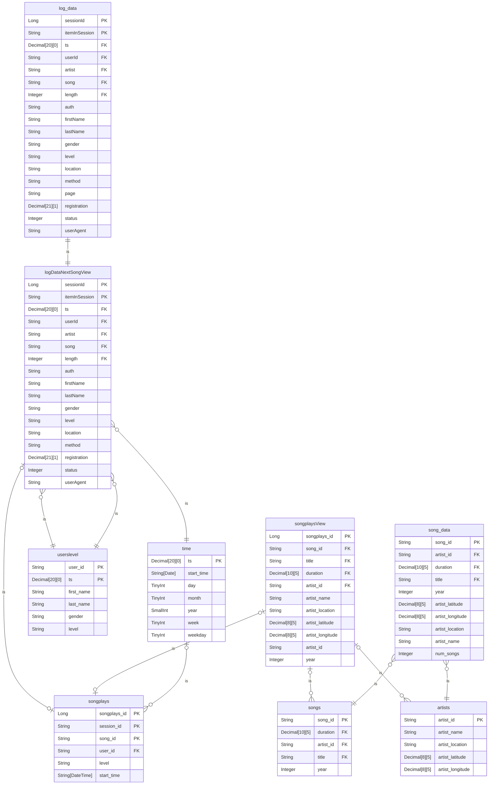

<p align="center">
  <a href="" rel="noopener">
 </a>
</p>

<h3 align="center">Sparkify Datalake</h3>


https://user-images.githubusercontent.com/9287209/222537943-0e39b51c-dfb0-49ec-a2e6-13f19d2bcf3a.mp4


---

<center> </center>
<p align="center"> Processing .json files to build a parquet table with Spark in Scala.
    <br>
</p>

---
## Table of Contents

- [Table of Contents](#-table-of-contents)
- [About ](#about)
- [Technologies](#technologies)
- [How to run this project](#howto)
- [About the data](#data)
- [Technical debts](#debts)


## About <a name = "about"></a>
This project aims to be a showcase of a Spark Scala application. To make this happen we consume `json` files residing under the subdirectory `input`, develop a data model and generate a table called `songplays` which shows a detailed view of songs played by a `user_id`.

## Technologies <a name = "technologies"></a>

This project was made using:

- [Amazon Correto 11](https://docs.aws.amazon.com/corretto/latest/corretto-11-ug/downloads-list.html)
- [sbt 1.8.2](https://www.scala-sbt.org/download.html)
- [Scala 2.3.10](https://www.scala-lang.org/download/)

## How execute this project?<a name = "howto"></a>

To execute this project you will need the input data available [here](https://drive.google.com/drive/folders/1H6EN9DJlBFNv7w4WQJhOyDMGJujGq-j2?usp=share_link) and download this repository. Put this repository and the `app` input data under the same root

```
.
└── some-root/
    ├── app/
    │   └── sparkify/
    │       └── input
    └── SparkifyLake
```

After that, just execute the following command at `SparkifyLake` directory:

```
sbt compile
sbt run
```

Or open the project with your favorite IDE, build and run!

A successful execution will have the following lines

```
+------------+------------------+----------+-------+-----+-------------------+
|songplays_id|           song_id|session_id|user_id|level|         start_time|
+------------+------------------+----------+-------+-----+-------------------+
|          54|SOZCTXZ12AB0182364|       818|     15| paid|2018-11-21 19:56:47|
+------------+------------------+----------+-------+-----+-------------------+
```


## About the data <a name = "data"></a>

The data we will be working on could be stored stored in two `S3` buckets. Let's pretend that this is what happens here :smile:
* **Log data**: contains users events on platform and have the following format:
```json
{
    "artist":"Zero 7",
    "auth":"Logged In",
    "firstName":"Kaylee",
    "gender":"F",
    "itemInSession":2,
    "lastName":"Summers",
    "length":199.96689,
    "level":"free",
    "location":"Phoenix-Mesa-Scottsdale, AZ",
    "method":"PUT",
    "page":"NextSong",
    "registration":1540344794796.0,
    "sessionId":181,
    "song":"You're My Flame [Album Version]",
    "status":200,
    "ts":1541554764796,
    "userAgent":"\"Mozilla\/5.0 (Windows NT 6.1; WOW64) AppleWebKit\/537.36 (KHTML, like Gecko) Chrome\/35.0.1916.153 Safari\/537.36\"",
    "userId":"8"
}
```
* **Song Data**: the song data contains the information about the song such as the artist/interpreter of the song, the location in which the interpreter resides, title of the song, duration of the song, among other informations. The `json` file has the following structure:
```json
{
  "num_songs": 1,
  "artist_id": "ARJIE2Y1187B994AB7",
  "artist_latitude": null,
  "artist_longitude": null,
  "artist_location": "",
  "artist_name": "Line Renaud",
  "song_id": "SOUPIRU12A6D4FA1E1",
  "title": "Der Kleine Dompfaff",
  "duration": 152.92036,
  "year": 0
}
```

## Data Model



## Data Dictionary

### log_data and logDataNextSongView

|    column     |              description               |      data type      |
| :-----------: | :------------------------------------: | :-----------------: |
|   sessionId   |               Session ID               |      Long (PK)      |
| itemInSession |         Item played in session         |    Integer (PK)     |
|      ts       | Timestamp at which the session started | Decimal(20, 0) (FK) |
|    userId     |                User ID                 |     String (FK)     |
|    artist     |              Artist Name               |     String (FK)     |
|     song      |               Song title               |     String (FK)     |
|    length     |         Song length in seconds         |   Decimal(10, 5)    |
|     auth      |         Authentication status          |       String        |
|   firstName   |            User first name             |       String        |
|   lastName    |             User last name             |       String        |
|    gender     |              User gender               |       String        |
|     level     |            User tier level             |       String        |
|   location    |             User location              |       String        |
|    method     |            API Rest method             |       String        |
|     page*     |         Application page name          |       String        |
| registration  |         User registration date         |   Decimal(21, 1)    |
|    Status     |          API Status Response           |       Integer       |
|   userAgent   |      User's browser and platform       |       String        |

> The column *page* is available at **log_data** table. The view **logDataNextSongView** is all items from **log_data** with **page = NextSong**.

### song_data

|      column      |                description                |      data type      |
| :--------------: | :---------------------------------------: | :-----------------: |
|     song_id      |                  Song ID                  |     String (PK)     |
|    artist_id     |                 Artist ID                 |     String (FK)     |
|     duration     |         Song duration in seconds          | Decimal(10, 5) (FK) |
|      title       |                Song title                 |     String (FK)     |
|       year       |         Release year of the song          |       Integer       |
| artist_latitude  |         Latitude of artist's home         |    Decimal(8,5)     |
| artist_longitude |        Longitude of artist's home         |    Decimal(8, 5)    |
| artist_location  |         Location of artist's home         |       String        |
|   artist_name    |               Artist's name               |       String        |
|    num_songs     | Number of songs released at the same year |       Integer       |


### songs

|  column   |       description        |      data type      |
| :-------: | :----------------------: | :-----------------: |
|  song_id  |         Song ID          |     String (PK)     |
| artist_id |        Artist ID         |     String (FK)     |
| duration  | Song duration in seconds | Decimal(10, 5) (FK) |
|   title   |        Song title        |     String (FK)     |
|   year    | Release year of the song |       Integer       |


### artists

|      column      |        description         |   data type   |
| :--------------: | :------------------------: | :-----------: |
|    artist_id     |         Artist ID          |  String (PK)  |
|   artist_name    |       Artist's Name        |    String     |
| artist_location  | Location of artist's home  |    String     |
| artist_latitude  | Latitude of artist's home  | Decimal(8,5)  |
| artist_longitude | Longitude of artist's home | Decimal(8, 5) |


### time

|   column   |                  description                  |            data type             |
| :--------: | :-------------------------------------------: | :------------------------------: |
|     ts     |    Timestamp at which the session started     | BigDecimal(20, 0) (PK, Not Null) |
| start_time |     Datetime at which the session started     |   String[DateTime] (Not Null)    |
|    day     | Day of the month at which the session started |        Tinyint (Not Null)        |
|   month    |      Month at which the session started       |        Tinyint (Not Null)        |
|    year    |       Year at which the session started       |       Smallint (Not Null)        |
|    week    | Week of the year at which the session started |        Tinyint (Not Null)        |
|  weekday   | Day of the week at which the session started  |        Tinyint (Not Null)        |


### userslevel

|    column    |                  description                  |      data type      |
| :----------: | :-------------------------------------------: | :-----------------: |
|   user_id    |                    User ID                    |     String (PK)     |
|      ts      |  Timestamp at which the last session started  | Decimal(20, 0) (PK) |
|  first_name  |                User first name                |       String        |
|  last_name   |                User last name                 |       String        |
|    gender    | User genderMonth at which the session started |       String        |
|    level     |                User tier level                |       String        |
| registration |        Timestamp of last registration.        |    Decimal(21,1)    |


### songplaysView

|      column      |                description                |      data type      |
| :--------------: | :---------------------------------------: | :-----------------: |
|   songplays_id   |                Songplay ID                |      Long (PK)      |
|     song_id      |                  Song ID                  |     String (FK)     |
|    artist_id     |                 Artist ID                 |     String (FK)     |
|     duration     |         Song duration in seconds          | Decimal(10, 5) (FK) |
|      title       |                Song title                 |     String (FK)     |
|       year       |         Release year of the song          |       Integer       |
| artist_latitude  |         Latitude of artist's home         |    Decimal(8,5)     |
| artist_longitude |        Longitude of artist's home         |    Decimal(8, 5)    |
| artist_location  |         Location of artist's home         |       String        |
|   artist_name    |               Artist's name               |       String        |
|    num_songs     | Number of songs released at the same year |       Integer       |


### songplays

|    column    |              description              |    data type     |
| :----------: | :-----------------------------------: | :--------------: |
| songplays_id |              Songplay ID              |    Long (PK)     |
|  session_id  |            User session ID            |     Long(PK)     |
|   song_id    |                Song ID                |   String (FK)    |
|   user_id    |                User ID                |   String (FK)    |
|    level     |            User tier level            |      String      |
|  Start_time  | Datetime at which the session started | String[DateTime] |

## Technical debts<a name = "debts"></a>

### Make logs less verbose

### Generate a functional .JAR file

https://user-images.githubusercontent.com/9287209/222537649-37db7202-0edd-4129-ac00-56f8b689a25c.mp4


### Understand why running with sbt exits with error

